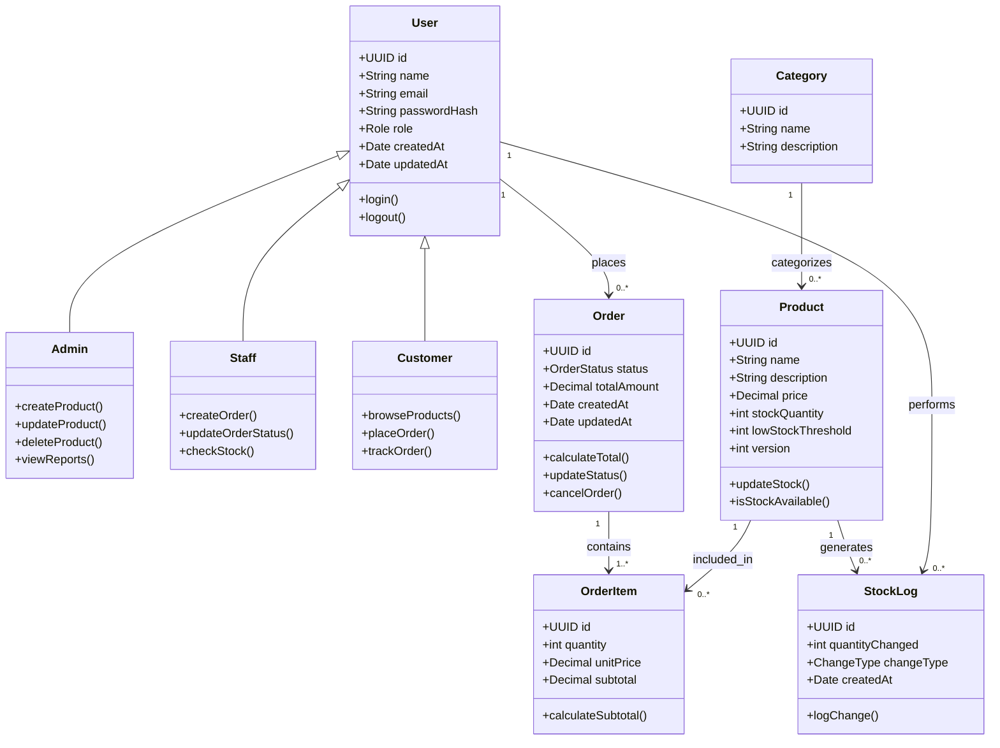

# Class Diagram — Inventory & Order Management System

## Overview

This class diagram represents the object-oriented design of the Inventory & Order Management System.  
It illustrates core entities, their attributes, methods, and relationships following OOP principles and clean architecture.

---

---

### Flow Summary

| Layer | Responsibility | OOP Concept |
| :--- | :--- | :--- |
| **User Hierarchy** | Admin, Staff, Customer inherit from User | **Inheritance**, **Polymorphism** |
| **Product & Inventory** | Handles stock validation and updates | **Encapsulation** |
| **Order Lifecycle** | Manages order states and transitions | **Abstraction**, **State Logic** |
| **Stock Logging** | Tracks inventory changes | **Audit Responsibility** |

