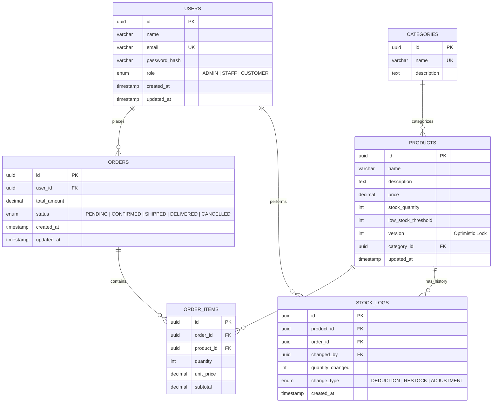

# ER Diagram — Inventory & Order Management System

## Overview

This ER diagram represents the core database structure for the Inventory & Order Management System, including users, products, orders, and stock tracking with strong data integrity and workflow control.

---

---

### Flow Summary

| Phase | Description | Key Concepts |
| :--- | :--- | :--- |
| **1. Data Integrity** | `USERS` stores `password_hash` instead of plain text passwords. | **Hashing**, **Security Best Practices** |
| **2. Concurrency Control** | `PRODUCTS.version` enables optimistic locking during stock updates. | **Optimistic Locking**, **Versioning** |
| **3. Order Lifecycle** | `ORDERS.status` manages structured order progression. | **State Persistence**, **Enum Enforcement** |
| **4. Audit Trail** | `STOCK_LOGS` records every inventory change for accountability. | **Audit Logging**, **Traceability** |
