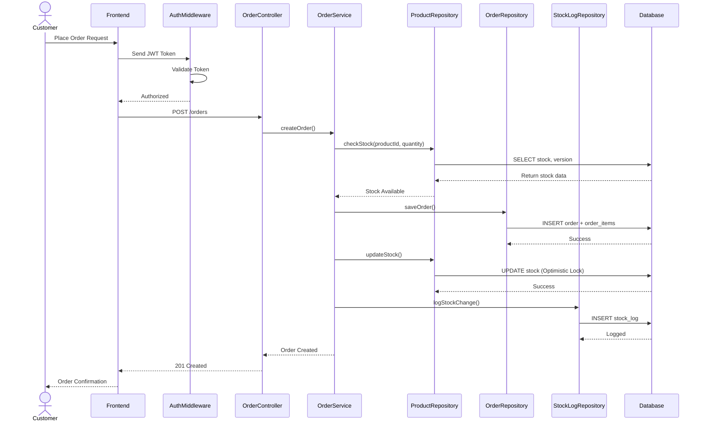

# Sequence Diagram — Inventory & Order Management System

## Overview

This sequence diagram illustrates the primary workflow of the system:  
**Customer placing an order**, including authentication, stock validation, order creation, stock deduction, and audit logging.

---

---

### Flow Summary

| Step | Description | Backend Concept |
| :--- | :--- | :--- |
| **1. Authentication** | JWT token validated before processing request | Middleware, Security |
| **2. Stock Validation** | Product stock checked before order creation | Business Logic Layer |
| **3. Transactional Save** | Order and order items saved atomically | Database Transaction |
| **4. Concurrency Control** | Stock updated using version check | Optimistic Locking |
| **5. Audit Logging** | Stock changes recorded in `StockLog` | Traceability |
| **6. Response Handling** | Proper HTTP status returned | RESTful API Design |

