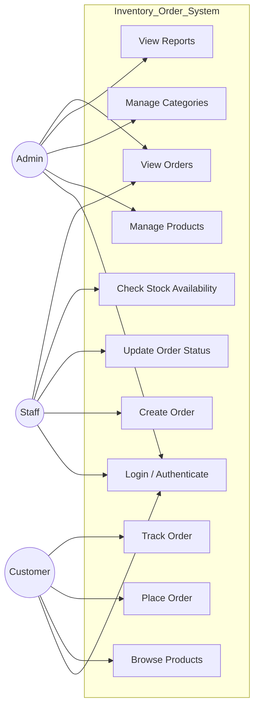

# Use Case Diagram — Inventory & Order Management System

## Overview

This use case diagram represents the interactions between system actors (Admin, Staff, Customer) and the Inventory & Order Management System.

It highlights role-based access and core system functionalities.

---

---

### Flow Summary

| Actor | Responsibilities | System Capability |
| :--- | :--- | :--- |
| **Admin** | Full system control | Product management, reporting, oversight |
| **Staff** | Operational management | Order processing and stock validation |
| **Customer** | Purchase interaction | Browse products, place and track orders |
| **System** | Enforces business rules | Authentication, stock validation, lifecycle control |

